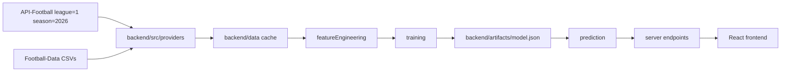

# Arquitetura

## Visao Geral

## Frontend

O frontend em `src/` usa React, CSS Modules e dados de backend. Se o backend local nao responder, usa `src/data/matches.ts` como fallback marcado.

Componentes principais:

- `App.tsx`: estado global, filtros, carregamento do backend.
- `Sidebar.tsx`: filtros por competicao, periodo e mercado.
- `MatchList.tsx`: lista tabular.
- `AnalysisPanel.tsx`: metadados, mercados disponiveis/ignorados e aviso etico.

## Backend

O backend fica em `backend/src`.

- `providers/apiFootballProvider.ts`: fixtures/resultados/eventos/estatisticas da API-Football.
- `providers/footballDataProvider.ts`: CSVs historicos Football-Data.co.uk.
- `featureEngineering.ts`: normalizacao e labels auxiliares.
- `markets.ts`: definicao e labels de mercados.
- `training.ts`: modelo de frequencias segmentadas.
- `evaluation.ts`: accuracy, brier score e cobertura.
- `backtesting.ts`: backtesting temporal.
- `prediction.ts`: resposta com mercados disponiveis e ignorados.
- `server.ts`: endpoints HTTP.
- `cli/*`: comandos de sync, treino, avaliacao e backtest.

## Cache

`backend:sync` grava:

- `backend/data/combined-results.csv`
- `backend/data/fixtures.json`
- `backend/data/sync-metadata.json`

Isso evita depender da API a cada render do frontend.

## Atualidade de Fixtures

`GET /fixtures` retorna apenas jogos com `isoDate` maior que o horario atual. Assim, quando chega o horario de inicio da partida, ela deixa de aparecer. O frontend consulta o backend a cada 30 segundos e tambem faz poda local a cada 5 segundos para evitar que uma partida permaneça visivel entre duas consultas.

Quando `API_FOOTBALL_KEY` esta configurada, o backend pode atualizar o cache da API-Football automaticamente respeitando `BETINTEL_FIXTURE_REFRESH_MS`.
