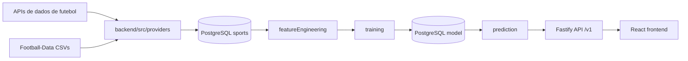

# Arquitetura

## Visao Geral

## Frontend

O frontend em `frontend/` usa React, Vite, CSS Modules e dados do backend. Se o backend local nao responder, mostra erro/estado vazio e nao troca para partidas mockadas. `frontend/src/data/matches.ts` fica apenas como base de demonstracao/teste, fora do fluxo principal.

Componentes principais:

- `App.tsx`: estado global, filtros, carregamento do backend.
- `Sidebar.tsx`: filtros por competicao, periodo e mercado.
- `MatchList.tsx`: lista tabular.
- `AnalysisPanel.tsx`: metadados, mercados disponiveis/ignorados e aviso etico.

## Backend

O backend fica em `backend/src`.

- `providers/apiFootballProvider.ts`: fixtures/resultados/eventos/estatisticas da API-Football.
- `providers/footballDataProvider.ts`: CSVs historicos Football-Data.co.uk.
- `featureEngineering.ts`: normalizacao e labels auxiliares.
- `markets.ts`: definicao e labels de mercados.
- `training.ts`: modelo de frequencias segmentadas.
- `evaluation.ts`: accuracy, brier score e cobertura.
- `backtesting.ts`: backtesting temporal.
- `prediction.ts`: resposta com mercados disponiveis e ignorados.
- `httpApp.ts`: composition root Fastify, OpenAPI e plugins transversais.
- `interfaces/http/fastify/`: schemas TypeBox, hooks de seguranca e rotas `/v1`.
- `server.ts`: composition root do processo HTTP.
- `application/ports/persistence.ts`: contratos sem dependencia de banco.
- `infrastructure/database/*`: Drizzle, pool e adapters PostgreSQL.
- `cli/*`: comandos de sync, treino, avaliacao e backtest.

## Persistencia

`backend:sync`, treino, avaliacao e backtest persistem no PostgreSQL. Os schemas sao:

- `sports`: dados esportivos compartilhados, sem tenant.
- `model`: datasets, modelos, segmentos, predicoes e avaliacoes.
- `iam`: organizacoes, usuarios, memberships e credenciais metadata-only.
- `billing`: catalogo e estado financeiro server-side.
- `ops`: estado operacional, exports, jobs e auditoria append-only.

Arquivos em `backend/data` e `backend/artifacts` sao aceitos somente pelo importador explicito. Nao existe fallback persistente em disco no runtime.

## Atualidade de Fixtures

`GET /v1/fixtures` retorna apenas jogos com `isoDate` maior que o horario atual. O
frontend usa cache curto, permite atualização manual e revalida ao reconectar ou ao
retornar à aba depois da janela de frescor. Também agenda uma atualização para o
próximo início conhecido. Não existe polling agressivo nem calendário fictício como
fallback.

Quando `API_FOOTBALL_KEY` esta configurada, o backend pode atualizar fixtures reais. Falha de provider e relatada sem gerar fixtures simuladas.
