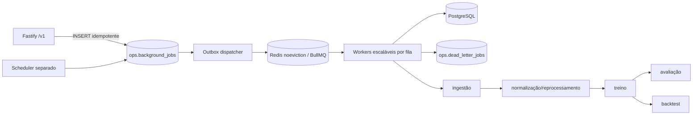

# Jobs assíncronos com BullMQ e Redis

- Estado: implementado
- Data: 2026-07-15
- ADR: [`0004-redis-and-bullmq.md`](adr/0004-redis-and-bullmq.md)

## Resultado

A API não executa ingestão, normalização, treino, avaliação, backtest, exportação,
notificação ou reconciliação de billing. O handler grava um job idempotente no
PostgreSQL e responde `202`; um dispatcher separado publica o outbox no BullMQ e
workers independentes executam o trabalho.

PostgreSQL permanece a fonte de verdade. Redis coordena entrega, locks do BullMQ,
retries e rate limit distribuído, mas não concede autorização nem substitui o estado
de negócio. Falha de Redis não perde pedidos já persistidos: a linha permanece no
outbox para nova tentativa com backoff. Em produção, o rate limit falha fechado e
pode rejeitar novos requests durante a indisponibilidade.

## Filas

| Fila | Tipos atuais | Concorrência | Tentativas | Timeout |
| --- | --- | ---: | ---: | ---: |
| `ingestion` | `sports-sync` | 2 | 5 | 15 min |
| `normalization` | `sports-normalization` | 4 | 3 | 10 min |
| `training` | `model-training` | 1 | 3 | 30 min |
| `evaluation` | `evaluation` | 2 | 3 | 20 min |
| `backtest` | `backtest` | 1 | 3 | 30 min |
| `export` | `export` | 2 | 3 | 20 min |
| `notification` | `notification` | 10 | 5 | 2 min |
| `billing-reconciliation` | `billing-reconciliation` | 2 | 5 | 10 min |
| `maintenance` | `privacy-retention` | 1 | 5 | 20 min |

As políticas ficam centralizadas em
`backend/src/application/jobs/policies.ts`. Todas usam backoff exponencial com
jitter de 50%. Jobs concluídos ficam no Redis por até 24 horas/1.000 itens; falhas,
por até 30 dias/5.000 itens. O histórico durável permanece no PostgreSQL.

As filas de exportação, notificação e billing estão registradas e podem receber
workers separados, mas seus processadores de negócio permanecem deliberadamente
indisponíveis até object storage, provedor de e-mail e gateway de billing serem
aprovados. Se um job desses for publicado sem processador, ele falha de forma
irrecuperável e vai para DLQ; nunca improvisa entrega ou payload financeiro.

## Fluxo e consistência



Entrega é pelo menos uma vez. A consistência vem de quatro camadas:

1. `UNIQUE(queue, idempotency_key)` no PostgreSQL;
2. `jobId` fixo igual ao UUID durável no BullMQ;
3. conteúdo esportivo deduplicado por hash e fonte/ID externo;
4. `source_job_id` único em `model.model_versions` e `model.evaluations`.

Se o dispatcher cair depois de publicar no Redis e antes de marcar
`dispatched_at`, a republicação usa o mesmo `jobId` e não cria outro job. Se o worker
cair depois de persistir um modelo e antes do ACK, a nova tentativa reutiliza a
mesma `model_version` por `source_job_id`.

## Pipeline esportivo

1. `sports-sync` consulta somente fontes reais configuradas.
2. Antes de cada request, o guard verifica circuit breaker, reserva cota no banco e
   obtém um slot distribuído no Redis.
3. A importação transacional detecta resultados corrigidos.
4. Um dataset novo/corrigido cria `sports-normalization` com chave
   `dataset:<datasetVersionId>`.
5. Normalização reconstrói/valida a feature table e cria treino para o mesmo dataset.
6. Treino adquire advisory lock PostgreSQL por dataset e cria avaliação/backtest para
   a versão persistida.

Ausência ou falha das fontes aborta o sync quando nenhum dado real é obtido. Não há
fixture, CSV, resultado ou probabilidade simulada como fallback de worker.

## Circuit breaker e cotas

O circuit breaker é distribuído no Redis por provider. Após três falhas transitórias
consecutivas, abre por 60 segundos. Sucesso fecha o circuito. HTTP `429`, falhas de
rede e `5xx` são falhas externas; erros de quota são classificados separadamente.

`ops.provider_api_usage` registra contadores diários e mensais atomicamente. O limite
e o percentual de alerta vêm somente do ambiente do servidor. Ao cruzar o limiar, o
worker emite log `provider_quota_alert` sem token, URL com credencial ou corpo de
resposta. Estouro impede a chamada e não gera fallback.

## Locks, timeout e cancelamento

- BullMQ mantém lock de entrega e recupera jobs stalled após crash.
- Treino usa `pg_try_advisory_lock` com chave do dataset, impedindo dois treinos do
  mesmo conjunto mesmo em réplicas distintas.
- Cada fila possui timeout. Um `AbortSignal` é propagado para requests externos e
  checado antes de efeitos persistentes.
- `DELETE /v1/admin/jobs/:id` registra cancelamento; jobs aguardando não iniciam e
  jobs ativos cancelam cooperativamente no próximo boundary seguro.
- CPU síncrona já iniciada não é interrompida no meio de uma operação; o worker
  verifica cancelamento antes de persistir o efeito.

## DLQ e inspeção

Após esgotar tentativas — ou diante de erro irrecuperável — o worker grava uma linha
única em `ops.dead_letter_jobs`. A DLQ contém apenas IDs, fila, tipo, número de
tentativas, código estável e correlações de modelo/dataset. Não possui coluna de
payload, token, PII, segredo ou corpo financeiro.

`GET /v1/admin/queues` expõe contagens e idade do job mais antigo somente para a
permissão central `system.manage`. `GET /v1/admin/jobs/:id` e cancelamento continuam
limitados ao solicitante. Não existe Bull Board público nem endpoint direto do Redis.

## Logs

Eventos `job_dispatched`, `job_started`, `job_succeeded` e `job_failed` carregam:

- `jobId`;
- `requestId`, quando originado por HTTP;
- `datasetVersion`;
- `modelVersion`;
- fila, tentativa e código estável de falha.

Payload do job, Authorization, API key, CSV bruto, e-mail e dados financeiros nunca
são registrados.

Jobs esportivos/modelo são globais e não carregam `organization_id`. Exportações,
notificações ou outros recursos privados exigem `scope=organization` e
`organization_id` derivado do contexto validado no servidor; payload enviado pelo
cliente nunca define o tenant.

## Processos e escalabilidade

```bash
npm run backend:serve       # somente API
npm run backend:worker      # dispatcher + workers selecionados
npm run backend:scheduler   # cron/loop de ingestão sem tráfego HTTP
```

`WORKER_QUEUES` permite escalar processos por carga, por exemplo:

```env
WORKER_QUEUES=training,backtest
```

O scheduler cria no máximo um `sports-sync` por dia usando chave determinística. O
intervalo apenas controla quando ele verifica o bucket diário; não duplica ingestão.
Em uma PaaS, scheduler e workers usam serviços/containers separados da API.

## Configuração

```env
REDIS_URL=redis://127.0.0.1:6379
BULLMQ_REDIS_URL=redis://127.0.0.1:6379
REDIS_KEY_PREFIX=betintel:development
WORKER_DATABASE_URL=postgresql://betintel_worker:.../betintel
SCHEDULER_DATABASE_URL=postgresql://betintel_scheduler:.../betintel
WORKER_QUEUES=ingestion,normalization,training,evaluation,backtest
JOB_DISPATCH_INTERVAL_MS=1000
INGESTION_SCHEDULER_INTERVAL_MS=3600000
API_FOOTBALL_DAILY_QUOTA=100
API_FOOTBALL_MONTHLY_QUOTA=3000
FOOTBALL_DATA_DAILY_QUOTA=1000
FOOTBALL_DATA_MONTHLY_QUOTA=30000
PROVIDER_QUOTA_ALERT_PERCENT=80
```

Em produção, `REDIS_URL`, `WORKER_DATABASE_URL` e `SCHEDULER_DATABASE_URL` são
obrigatórias. O Redis dedicado ao BullMQ deve usar `maxmemory-policy=noeviction`,
persistência e backup compatíveis com o SLO. Cache/rate limit pode usar instância
separada; nunca compartilhar com política de eviction que possa apagar jobs.

## Validação

```powershell
$env:TEST_DATABASE_URL='postgresql://.../postgres'
$env:TEST_REDIS_URL='redis://127.0.0.1:6379'
$env:BETINTEL_REQUIRE_DB_TESTS='true'
npm run backend:test
```

Os testes reais cobrem duplicidade/outbox, restart entre publish e ACK, retry/DLQ,
falha externa/circuit breaker, quota, lock de treino, correção/reprocessamento,
idempotência do efeito de treino e rate limit compartilhado por duas réplicas HTTP.

## Rollback

1. Pausar `backend:scheduler` para impedir novos jobs automáticos.
2. Pausar o dispatcher e deixar workers concluírem jobs ativos com shutdown gracioso.
3. Registrar profundidade por fila, jobs ativos, delayed e DLQ antes de qualquer
   alteração no Redis.
4. Restaurar a imagem anterior compatível com a migration expand-only. A API pode
   continuar gravando outbox, mas a fila crescerá enquanto workers estiverem parados.
5. Não apagar Redis, `ops.background_jobs`, DLQ, cotas, modelos ou avaliações.
6. Reprocessar somente por chave idempotente após corrigir a causa. Não editar status
   manualmente nem executar pipeline pesado dentro da API.
7. Reverter `0007_bullmq_jobs.sql` apenas depois de drenar/cancelar jobs, retirar
   referências `source_job_id` e comprovar que nenhuma imagem nova está ativa. Em
   incidente normal, preferir forward-fix; as colunas e tabelas são aditivas.

Critérios para rollback: perda de conexão Redis persistente, crescimento não
controlado do outbox/DLQ, quebra de idempotência, execução cruzada entre organizações
ou divergência entre efeito persistido e status do job.
