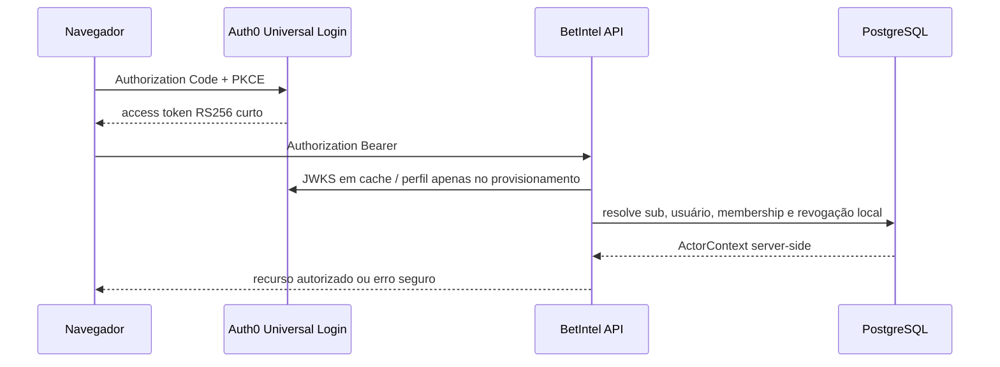

# Identidade e acesso com Auth0

- Estado: implementado localmente; liberação de produção bloqueada pelos gates abaixo
- ADR: [`0005-managed-identity-provider.md`](adr/0005-managed-identity-provider.md)
- Escopo: autenticação gerenciada, autorização local e operações de conta

O Auth0 prova a identidade. PostgreSQL é a fonte de verdade para usuário local,
organização, membership, papel, sessão bloqueada, API keys e auditoria. O
backend nunca aceita `organization_id`, `tenant_id`, plano, papel ou permissão
enviados pelo cliente como autoridade.



## Configuração por ambiente

Crie, em cada tenant/ambiente, três registros separados:

1. **Single Page Application** para React. Habilite Authorization Code com PKCE,
   Refresh Token Rotation e reuse detection. Não crie nem exponha client secret.
2. **API** com identifier igual a `AUTH0_AUDIENCE`, algoritmo RS256 e access token
   curto (recomendação operacional: cinco minutos; validar impacto antes do go-live).
3. **Machine to Machine Application** autorizada somente para a Auth0 Management
   API e com os menores scopes compatíveis com `read:users`, `update:users`,
   `delete:users`, `read:sessions` e `delete:sessions`. Confirme os scopes efetivos
   no tenant: eles variam conforme endpoint e plano.

Configure URLs exatas, sem wildcard:

| Ambiente | Allowed Callback URLs | Allowed Logout URLs | Allowed Web Origins |
| --- | --- | --- | --- |
| local | `http://localhost:5173` | `http://localhost:5173` | `http://localhost:5173` |
| homolog/prod | origem HTTPS daquele ambiente | mesma origem HTTPS | mesma origem HTTPS |

Use tenant, SPA, API, M2M, banco de usuários e secrets distintos entre
desenvolvimento, homolog e produção. Valores versionados são proibidos.

Backend:

```text
DATABASE_URL
AUTH0_DOMAIN
AUTH0_AUDIENCE
AUTH0_SPA_CLIENT_ID
AUTH0_MANAGEMENT_CLIENT_ID
AUTH0_MANAGEMENT_CLIENT_SECRET
AUTH0_SESSION_ID_CLAIM=https://betintel.ai/session_id
AUTH0_AUTH_TIME_CLAIM=https://betintel.ai/auth_time
CORS_ALLOWED_ORIGINS=https://app.example
REQUEST_IP_HASH_KEY
```

Frontend, apenas valores públicos:

```text
VITE_AUTH0_DOMAIN
VITE_AUTH0_CLIENT_ID
VITE_AUTH0_AUDIENCE
```

O SDK usa cache em memória, `useRefreshTokens=true` e fallback de iframe
desativado. O BetIntel não grava access/refresh token, senha, TOTP ou recovery code
em `localStorage`, cookie próprio ou banco. Como a API usa bearer token e não cookie
de sessão próprio, CSRF não se aplica às rotas atuais; qualquer autenticação por
cookie futura exige `HttpOnly`, `Secure`, `SameSite` e defesa CSRF.

## Configuração do Universal Login

- habilitar Database Connection, signup e verificação de e-mail;
- usar respostas equivalentes nos fluxos de recovery para evitar enumeração;
- configurar password reset com expiração curta e comportamento de uso único;
- habilitar Brute-force Protection e Suspicious IP Throttling, registrar limiares e
  testar bloqueio progressivo sem criar uma rota local de senha;
- habilitar MFA OTP/TOTP e recovery codes; o código de recuperação deve ser
  mostrado somente pelo Auth0 e validado como uso único;
- habilitar Refresh Token Rotation, expiração absoluta/inativa e Automatic Reuse
  Detection; registrar o overlap period aprovado;
- rever templates de e-mail, domínio remetente, idiomas, rate limits, logs, retenção
  e alertas por ambiente.

### Claim da sessão

O backend exige um ID de sessão no access token para revogação local imediata.
Adicione uma Post-Login Action versionada e implantada por ambiente:

```js
const SESSION_CLAIM = 'https://betintel.ai/session_id'
const AUTH_TIME_CLAIM = 'https://betintel.ai/auth_time'

exports.onExecutePostLogin = async (event, api) => {
  const metadata = event.refresh_token?.metadata ?? {}
  const sessionId = event.session?.id ?? metadata.betintel_session_id
  const methodTimes = (event.authentication?.methods ?? [])
    .map((method) => Date.parse(method.timestamp))
    .filter(Number.isFinite)
  const latestMethodTime = methodTimes.length ? Math.max(...methodTimes) : undefined
  const authenticatedAt = event.session?.authenticated_at
    ? Date.parse(event.session.authenticated_at)
    : latestMethodTime ?? Number(metadata.betintel_auth_time_ms)

  if (!sessionId || !Number.isFinite(authenticatedAt)) {
    api.access.deny('session_context_required')
    return
  }

  const isRefresh = event.transaction?.protocol === 'oauth2-refresh-token'
  if (!isRefresh && event.transaction?.requested_scopes?.includes('offline_access')) {
    api.refreshToken.setMetadata('betintel_session_id', sessionId)
    api.refreshToken.setMetadata('betintel_auth_time_ms', String(authenticatedAt))
  }

  api.accessToken.setCustomClaim(SESSION_CLAIM, sessionId)
  api.accessToken.setCustomClaim(AUTH_TIME_CLAIM, Math.floor(authenticatedAt / 1000))
}
```

A API de Actions exige que valores de metadata sejam strings. A metadata do
refresh token preserva os dois valores quando a Post-Login Action
roda numa troca de refresh sem todo o contexto interativo. Não use `Date.now()`
durante refresh: isso faria uma sessão antiga parecer recém-autenticada. A SPA chama
Universal Login com `max_age=0`; a Action recalcula o instante a partir dos métodos
de autenticação/sessão e emite o custom claim namespaced. Confirme no tenant que os
dois claims persistem após rotação e que reautenticação atualiza somente
`auth_time`. Ausência falha fechada.

## Backend e autorização

`Auth0IdentityProvider` valida RS256, JWKS, issuer exato, audience da API, `sub`,
`iat`, `exp` e session ID. Token expirado, de outro issuer/audience, ID token ou
chave desconhecida retorna 401. Falha de JWKS/Management API nunca libera acesso.

O primeiro access token válido busca o perfil server-side e provisiona
idempotentemente um usuário e organização pessoal sob advisory lock. Requisições
seguintes consultam o estado local. Usuário desabilitado, e-mail não confirmado,
membership revogada ou sessão revogada bloqueiam imediatamente, mesmo com JWT
ainda criptograficamente válido.

As rotas antigas permanecem temporariamente mapeadas, mas agora exigem identidade
válida. Apenas liveness/readiness são públicas. Sincronização e treino exigem papel
`owner` ou `admin`.

O modo visual `?demo=1` contorna apenas a tela de login do frontend e usa quatro
registros locais marcados como simulados, sem chamar a API. Ele existe para
screenshots e nunca autoriza rota, persiste estado ou funciona como fallback de
produção.

### Rotas de conta

| Rota | Regra |
| --- | --- |
| `GET /v1/me` | retorna IDs e papel derivados do banco |
| `GET /v1/account/sessions` | combina sessões Auth0 e bloqueios locais |
| `DELETE /v1/account/sessions/:id` | só revoga sessão do próprio usuário |
| `POST /v1/account/email-change` | reautentica, altera no Auth0, exige nova verificação e revoga sessões |
| `POST /v1/account/profile-sync` | sincroniza perfil confirmado sem confiar no cliente |
| `POST /v1/account/deactivate` | transfere ownership quando necessário, bloqueia local/externo |
| `DELETE /v1/account` | transfere ownership, anonimiza PII local e exclui identidade externa |

Auditoria é append-only e registra IDs internos, ação, request ID e metadata
mínima. Authorization, token, e-mail, IP bruto, senha, payload do Auth0, TOTP e
recovery code não entram nos logs. IP, quando necessário, é HMAC com secret por
ambiente; User-Agent tem quebras removidas e limite de tamanho.

## Gate comercial e matriz de aceitação

Os testes automatizados usam chave RSA/JWKS local e um fake controlado do contrato
de identidade; não chamam Auth0 real nem inventam autenticação como fallback de
produção. Eles cobrem tokens negativos, fail-closed, idempotência, revogação
local, membership, isolamento entre tenants, ownership e logs sem token.

Antes de produção, execute e guarde evidência no tenant real:

- [ ] plano contratado permite MFA TOTP e recovery codes no fluxo escolhido;
- [ ] cadastro exige verificação de e-mail e login não enumera usuários;
- [ ] brute force/credential stuffing produz throttle/bloqueio progressivo;
- [ ] password reset expira, é de uso único e invalida sessões conforme política;
- [ ] refresh token gira e reuso revoga a família esperada;
- [ ] TOTP, recovery code e tentativa de reutilizar recovery code funcionam como
  documentado;
- [ ] troca de e-mail exige reautenticação e reverificação;
- [ ] logout, expiração, lista e revogação de dispositivos funcionam;
- [ ] claims `session_id` e `auth_time` chegam no access token da API;
- [ ] M2M tem somente scopes necessários e secrets estão no secret manager;
- [ ] callback/logout/origins de cada ambiente rejeitam URLs não cadastradas;
- [ ] logs do Auth0 e da aplicação não expõem tokens/PII desnecessária;
- [ ] retenção, DPA, região, subprocessadores e exclusão foram revisados.

**Bloqueio conhecido:** a Auth0 documenta a API de gerenciamento de sessões usada
por lista/revogação de dispositivos como recurso Enterprise. Se o plano contratado
não a incluir, o requisito não está atendido. Não substituir por uma lista local
incompleta nem declarar aceite. MFA e recovery codes também precisam ser validados
no plano/tenant real. Portanto, o aceite de produção do PROMPT 3 permanece aberto.

## Rollback

1. Bloquear novas entradas nas rotas privadas e manter apenas health; nunca
   desabilitar validação JWT/membership para restaurar serviço.
2. Voltar a imagem anterior compatível; a migration `0004_identity_access.sql` é
   aditiva e pode permanecer aplicada.
3. Revogar sessões/refresh tokens do ambiente afetado e remover callback/origin da
   aplicação no Auth0.
4. Rotacionar credencial M2M e `REQUEST_IP_HASH_KEY` se houver suspeita de exposição.
5. Preservar `audit_log`; limpar PII somente pelo procedimento aprovado de retenção.
6. Para desfazer schema, primeiro provar que nenhuma imagem usa as novas colunas;
   criar migration forward de remoção. Não editar migration já aplicada.

Operações que bloqueiam localmente antes de chamar Auth0 podem retornar 503 quando
a atualização externa fica pendente. O acesso continua negado; uma fila/reconciliação
operacional deve ser adicionada antes do go-live para concluir a compensação sem
reabrir acesso.
