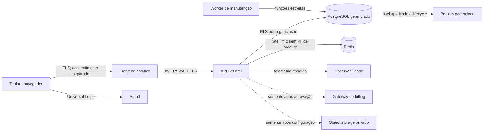

# Controles técnicos de privacidade e LGPD

> Documento técnico, não parecer jurídico. Bases legais, prazos fiscais, papel de
> controlador/operador, transferências internacionais e textos ao titular exigem
> **REVISÃO JURÍDICA OBRIGATÓRIA** antes de produção comercial.

## Inventário, classificação e finalidade

| Dado | Sistema | Classe | Finalidade técnica | Minimização | Retenção técnica |
|---|---|---|---|---|---|
| Auth0 subject, nome, e-mail, verificação | Auth0 + `iam.users` | pessoal restrito | identidade e recuperação | senha, TOTP e recovery codes nunca entram na aplicação | conta ativa; pseudonimizar na exclusão |
| organização, membership e convite | PostgreSQL `iam` | pessoal interno | autorização e colaboração | convite guarda e-mail somente até aceite/expiração | convite expirado/revogado + 30 dias |
| sessão, user agent e HMAC do IP | `iam.session_metadata` | pessoal restrito | segurança e revogação | IP bruto nunca é persistido | expiração + 7 dias; revogada + 30 dias |
| aceite, versão, hash, HMAC do IP | `legal.acceptances` | evidência restrita | prova de versão/manifestação | sem IP bruto e sem payload de token | **[VALIDAR JURÍDICO]**; legal hold explícito |
| consulta, alerta e exportação | `ops` | privado do tenant | funcionalidade solicitada | sem odds, contato ou PII desnecessária | exclusão do usuário/tenant; export no vencimento |
| conteúdo de suporte | `ops.support_tickets` | confidencial | atendimento e correção | UI proíbe senha/token; corpo cifrado AES-256-GCM | resolvido + 365 dias **[VALIDAR]** |
| evidência de incidente | `ops.incidents` | confidencial crítico | resposta e cadeia de custódia | página pública recebe só resumo saneado | resolvido + 730 dias **[VALIDAR]** |
| audit log | `ops.audit_log` | segurança restrita | responsabilização e investigação | metadata proíbe PII, segredo e payload | append-only; prazo **[VALIDAR JURÍDICO/SEGURANÇA]** |
| assinatura, uso e fatura | `billing` | financeiro restrito | cobrança e obrigações fiscais | cartão completo fica no gateway | **[VALIDAR JURÍDICO/CONTABILIDADE]**; não entra no expurgo genérico |
| fixtures/modelos compartilhados | `sports`/`model` | não pessoal | análise probabilística | sem vínculo com titular | política de datasets/modelos |

Novos campos só entram após atualizar esta tabela, finalidade, acesso, retenção e
operadores. Texto livre de suporte não deve ser reutilizado para treino ou analytics.

## Fluxo e operadores

- Auth0, hospedagem/PostgreSQL, observabilidade e eventuais gateways são
  operadores/suboperadores sujeitos a DPA, região e subprocessadores
  **[VALIDAR PROFISSIONALMENTE]**.
- A API não envia PII a provedores esportivos. Analytics não inicia antes do
  consentimento e nenhum provedor está configurado por padrão.
- Fontes são do sistema operacional; ícones, CSS, JS e status page são locais. Não
  há Google Fonts, CDN de terceiros ou pixel que receba IP sem necessidade.

## Criptografia e segredos

- TLS é obrigatório em deploy; PostgreSQL, Redis, Auth0, object storage e telemetria
  usam endpoints TLS. Criptografia de volume/backup deve ser habilitada no provedor.
- Conteúdo de suporte/incidente usa AES-256-GCM com nonce de 96 bits, AAD por
  registro e versão de chave. `PII_FIELD_ENCRYPTION_KEY` contém 32 bytes base64.
- Rotação: adicionar suporte à chave anterior, recriptografar em lote auditado,
  conferir contagens e só então retirar a chave antiga. Nunca registrar a chave.
- Senha, JWT, cookie, segredo TOTP, recovery code, API key em claro e payload de
  pagamento são proibidos em banco, job, audit e log.

## Direitos do titular

1. O usuário reautentica no Auth0.
2. `GET /v1/privacy/export` coleta seus registros em todos os tenants derivados das
   memberships, audita a ação e responde `private, no-store`; o frontend baixa JSON.
3. Correção de e-mail ocorre no Auth0 com nova verificação e revogação de sessões.
   Outras divergências viram chamado cifrado em `/v1/privacy/corrections`.
4. Exclusão de conta planeja objetos, apaga objetos/cache, remove dados ativos,
   revoga memberships/sessões, pseudonimiza a identidade e exclui no Auth0.
5. Exclusão de organização exige owner e autenticação recente; remove dados ativos,
   chaves, sessões, consultas, alertas, chamados, incidentes e predições privadas,
   fecha/pseudonimiza o tenant e mantém somente categorias com retenção declarada.

Se existir `object_key` e o adapter não estiver configurado, a exclusão retorna 503
antes de apagar metadados. Assim nenhum objeto fica órfão ou falsamente “excluído”.
O cliente limpa todo o cache em memória antes do logout.

## Retenção automatizada

O scheduler enfileira `privacy-retention` uma vez por dia. O worker de manutenção:

1. lista objetos de exportação vencidos pela função estreita;
2. apaga cada objeto; qualquer falha interrompe o job;
3. expurga metadata vencida, sessões, convites e conteúdo cifrado;
4. remove payload/result de jobs concluídos após 90 dias;
5. registra somente contagens, nunca conteúdo pessoal.

As funções `SECURITY DEFINER` têm `search_path` fixo e execução revogada de
`PUBLIC`; o deploy concede apenas ao papel `betintel_worker`. Audit log, billing e
aceites não são apagados por esse job enquanto a decisão profissional estiver aberta.

## Backups e exclusão

Backups gerenciados são imutáveis; não se promete edição cirúrgica. A política
técnica proposta é lifecycle máximo de **35 dias [VALIDAR COM JURÍDICO, CONTABILIDADE
E RPO/RTO]**. Um backup anterior à exclusão nunca volta diretamente ao tráfego:

1. restaurar em rede/conta isolada, sem e-mail, Auth0, jobs ou integrações;
2. obter o ledger de exclusões do sistema de auditoria externo ao backup restaurado;
3. repetir o coordenador de exclusão e o expurgo, incluindo objetos e caches;
4. verificar ausência por user/organization id e hashes conhecidos;
5. somente então promover a restauração, registrando evidências e aprovadores.

O ledger externo, lifecycle do provedor e drill trimestral são gates obrigatórios
antes de declarar exclusão coberta por backups em produção.

## Incidente e evidência

Preservar request/job/incident IDs, horários UTC, hashes e decisões; nunca copiar
token, e-mail, IP bruto ou payload completo para o incidente. Evidência sensível fica
cifrada no registro restrito. A comunicação pública usa somente `status-page/` e
segue o runbook. Notificação a titulares/ANPD, prazo e conteúdo dependem de avaliação
profissional do caso.

## Templates jurídicos

Os templates versionados ficam em `frontend/src/legal/terms-content.ts` e
`frontend/src/legal/policy-content.ts`. Campos entre colchetes e o aviso global
“MINUTA SUJEITA À REVISÃO…” impedem tratá-los como texto aprovado. Publicação exige
inventário final, operadores, prazos, responsável, canais e hashes novos.
