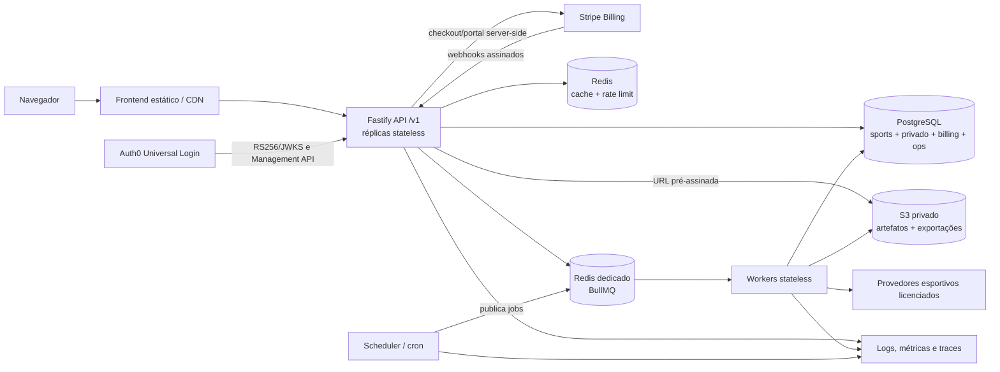
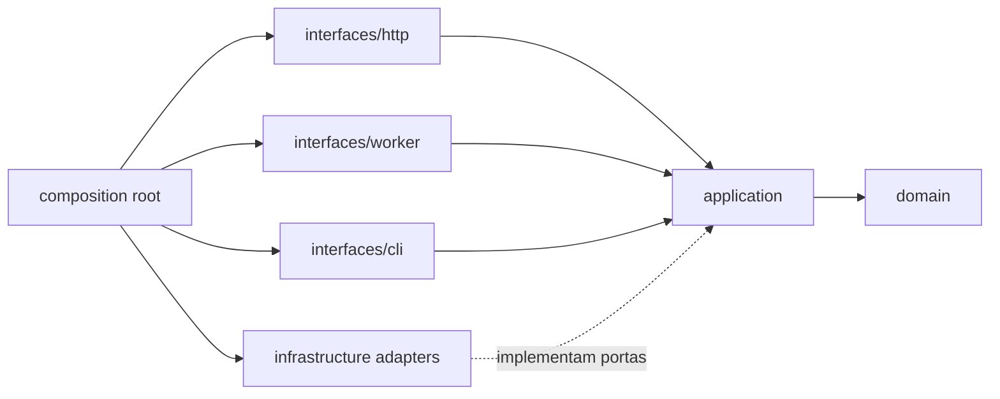

# Arquitetura-alvo e plano de migração

- Estado: proposta para revisão
- Data: 2026-07-15
- Escopo: desenho técnico com fases incrementais implementadas e gates operacionais
- ADRs relacionados: [`docs/adr/`](adr/README.md)
- Gate de produto: [`docs/business-validation.md`](business-validation.md)

> Atualização de implementação em 2026-07-15: as fases PostgreSQL, Auth0,
> organizações/RLS e adapter Fastify `/v1` foram implementadas incrementalmente.
> Redis/BullMQ foi implementado com outbox, workers e scheduler separados. Object
> A fundacao Docker/CI/CD, health checks e runbooks de continuidade foi
> implementada, mas deploy/rollback/PITR reais ainda exigem evidencias externas.
> Object storage e billing continuam gates pendentes. O estado atual da
> interface HTTP e seu rollback estão em [`fastify-api.md`](fastify-api.md).

## 1. Resultado esperado

Evoluir o BetIntel AI por estrangulamento incremental para uma aplicação:

- stateless na API e nos workers;
- multi-cliente, com organização resolvida no servidor e isolamento em profundidade;
- operável com deploy reproduzível, jobs assíncronos, observabilidade e rollback;
- fiel ao domínio acadêmico atual: `dados_insuficientes`, schemas de mercados, validação temporal, aviso ético e ausência de recomendação de apostas;
- incapaz de usar dados inventados como fallback de produção;
- condicionada a licença comercial dos dados, validação de comprador e orientação jurídica antes de billing.

Este documento não aprova a expansão comercial. O go/no-go continua regido pelo documento de validação de negócio.

## 2. Estado inicial registrado

Verificação imediatamente anterior a estes documentos:

| Verificação | Resultado |
| --- | --- |
| `npm run build` | aprovado; frontend Vite e backend TypeScript compilam |
| `npm run backend:test` | aprovado; 10 de 10 testes |
| lint | não há script de lint em `package.json` |
| typecheck isolado | não há script autônomo; os dois builds executam `tsc` |
| Persistência | cache em `backend/data/` e artefatos em `backend/artifacts/` |
| HTTP | `node:http` em `backend/src/server.ts` |
| ORM/migrations | inexistentes |

As alterações preexistentes no worktree não fazem parte deste desenho e não foram sobrescritas.

## 3. Escopo e não objetivos

Incluído:

- fronteiras de módulos e dependências;
- topologia de runtime;
- contrato proposto da API `/v1`;
- classificação e isolamento de dados;
- migração de HTTP e filesystem sem big bang;
- compatibilidade, desativação, rollback e backlog.

Não incluído nesta etapa:

- instalar Fastify, Drizzle, Redis/BullMQ ou SDKs;
- criar banco, migrations executáveis, login, organizações ou RLS;
- criar catálogo, checkout, webhook real ou entitlement;
- contratar PaaS, storage, identidade, dados ou cobrança;
- alterar rotas ou comportamento existente.

Não é necessário scaffolding de código para provar o desenho: os ADRs, contratos, limites de importação e gates de migração são o artefato verificável desta etapa.

## 4. Restrições invariantes

1. Dados esportivos compartilhados nunca têm `organization_id` ou `tenant_id`.
2. Todo recurso privado tem `organization_id NOT NULL`, derivado de identidade e membership verificadas no servidor.
3. Plano, preço, papel, permissões e assinatura nunca são aceitos do cliente como fonte de verdade.
4. Nenhuma rota transforma odds em recomendação, promete lucro ou exibe marca de casa de apostas.
5. Odds implícitas, quando licenciadas, só podem aparecer como baseline analítica identificada.
6. Ausência de coluna ou amostra continua produzindo `dados_insuficientes`, não zero, média inventada ou fixture simulada.
7. TypeScript permanece estrito; runtime input continua exigindo schema.
8. Secrets, tokens, PII e payloads financeiros não entram em logs nem respostas.
9. Toda mudança de storage/schema segue expand/contract e possui critério mensurável de rollback.
10. Fonte esportiva sem direito comercial aprovado não entra na ingestão de produção.

## 5. Resumo das decisões

| Tema | Decisão proposta | Limite |
| --- | --- | --- |
| HTTP | Fastify 5 + TypeBox + OpenAPI | apenas adapter HTTP |
| Banco | PostgreSQL gerenciado | estruturado e fonte de verdade |
| Acesso SQL | Drizzle + migrations SQL versionadas | tipos não vazam do adapter |
| Redis | cache/rate limit e instância BullMQ separada | nunca fonte de verdade |
| Identidade | Auth0 Universal Login atrás de `IdentityProvider` | autorização local; gate de plano |
| Billing | Stripe Billing atrás de `BillingGateway` | ativado só após gates |
| Objetos | AWS S3 privado atrás de `ObjectStorage` | binários e exportações |
| Deploy | containers no Render | sem Kubernetes nesta fase |
| Multicliente | PostgreSQL compartilhado + RLS | `organization_id` só no privado |

## 6. Diagrama de componentes



### Responsabilidade por componente

| Componente | Faz | Não faz |
| --- | --- | --- |
| Frontend | apresenta análises, aviso ético e estado de jobs | não decide tenant, plano ou autorização |
| API | autentica, valida schema, resolve organização, chama casos de uso | não treina modelo nem persiste em disco |
| Worker | executa ingestão, análise longa, treino, avaliação e exportação | não expõe HTTP público |
| Scheduler | cria ocorrência idempotente de job | não executa o trabalho |
| PostgreSQL | verdade estruturada, RLS, outbox/inbox | não guarda grandes binários |
| Redis cache | acelera leitura e limita taxa | não concede acesso nem substitui PostgreSQL |
| Redis BullMQ | coordena entrega de jobs | não torna handler exatamente-uma-vez |
| Object storage | guarda conteúdo imutável privado/compartilhado | não decide ownership |
| Provedor de identidade | prova identidade e sessão | não decide entitlement financeiro |
| Gateway de cobrança | informa ciclo financeiro | não é consultado diretamente pelo cliente para liberar acesso |

## 7. Fronteiras de código

### Regra de dependência



Importações permitidas:

- `domain` importa apenas biblioteca padrão e um `shared-kernel` mínimo;
- `application` importa `domain` e declara portas;
- `infrastructure` importa portas de `application`, nunca handlers;
- `interfaces` importam casos de uso e DTOs próprios, nunca SDKs/Drizzle;
- `composition-root` é o único lugar que conhece implementações concretas;
- módulos de domínio não importam uns aos outros por repositories. Coordenação ocorre em casos de uso ou eventos.

Uma regra automatizada de boundaries deverá falhar no CI quando ocorrer dependência inversa ou ciclo.

### Mapa de módulos proposto

```text
backend/src/
  domain/
    sports/             # fixture, competição, mercados, disponibilidade de dados
    analysis/           # probabilidades, dados_insuficientes, calibração e relatórios
    organizations/      # organização, membership e políticas de acesso
    billing/            # estados internos de assinatura e entitlement
    exports/            # solicitação, estado, retenção e ownership
  application/
    ports/
      sports-repository.ts
      analysis-repository.ts
      organization-repository.ts
      billing-gateway.ts
      identity-provider.ts
      object-storage.ts
      cache.ts
      job-queue.ts
      clock.ts
    use-cases/
      list-fixtures.ts
      request-analysis.ts
      get-analysis.ts
      sync-sports-data.ts
      train-model.ts
      evaluate-model.ts
      request-export.ts
      resolve-actor-context.ts
      process-billing-event.ts
  infrastructure/
    db/drizzle/
    identity/auth0/
    billing/stripe/
    cache/redis/
    queue/bullmq/
    storage/s3/
    sports-providers/
    observability/
  interfaces/
    http/fastify/v1/
    http/legacy/
    worker/
    cli/
  composition-root/
    api.ts
    worker.ts
    cli.ts
backend/migrations/
```

### Dependências funcionais

| Módulo | Pode consumir | Não pode consumir |
| --- | --- | --- |
| sports | provider port, sports repository | organização/billing |
| analysis | leitura sports, modelo, analysis repository | Stripe, Fastify, SDK de provider |
| organizations | identity port, organization repository | billing SDK |
| billing | billing gateway, org/entitlement repository | HTTP/frontend |
| exports | analysis read port, object storage, queue | filesystem local persistente |

O motor atual de features, mercados, treino, avaliação e predição será movido por extração, preservando comportamento e testes, não reescrito.

## 8. Modelo e isolamento de dados

### Classificação

| Schema | Exemplos | Escopo | Regra de tenant |
| --- | --- | --- | --- |
| `sports` | providers, competitions, seasons, teams, fixtures, results, statistics, model_versions, evaluation_reports | compartilhado | proibido `organization_id`/`tenant_id` |
| `iam` | users, organizations, memberships | privado/controle | membership liga user + organization |
| `private` | analysis_requests, saved_analyses, exports, preferences | organização | `organization_id NOT NULL` + RLS |
| `billing` | customers, subscriptions, entitlements | organização | `organization_id NOT NULL` + RLS |
| `ops` | outbox, webhook_inbox, jobs, audit_events | misto explícito | `scope` + constraint de organização |

Dados esportivos são compartilhados mesmo quando um plano limita a visualização. Entitlement controla a ação; não muda ownership nem duplica a fixture.

### Resolução do contexto

1. O plugin HTTP extrai o bearer token.
2. `IdentityProvider` verifica assinatura, issuer, audience e expiração.
3. `ResolveActorContext` mapeia subject externo para usuário interno.
4. A organização indicada por claim/slug é aceita somente se existir membership local ativa.
5. O servidor produz `ActorContext { userId, organizationId, permissions, entitlements }`.
6. O caso de uso recebe esse contexto; o body não contém `tenant_id` confiável.
7. O adapter abre transação e usa `SET LOCAL app.organization_id` antes da query privada.
8. RLS aplica default deny e `WITH CHECK`.

O papel da aplicação não é proprietário das tabelas e não possui `BYPASSRLS`. `FORCE ROW LEVEL SECURITY` é obrigatório. Workers reconstroem e revalidam o contexto organizacional a partir de IDs server-side do job.

### Cache e objetos

- Chave compartilhada: `env:sports:fixture:{fixtureId}:v{schemaVersion}`.
- Chave privada: `env:org:{organizationId}:analysis:{analysisId}:v{schemaVersion}`.
- O servidor monta todas as chaves; identificador não validado do cliente nunca vira prefixo.
- Artefatos globais ficam sob `shared/models/`; exportações sob `organizations/{organizationId}/exports/`.
- URLs pré-assinadas são curtas, específicas e emitidas após nova autorização.

## 9. Statelessness

Uma instância pode ser encerrada depois de qualquer request sem perder estado confirmado.

- sessões: provedor/JWT e estado necessário no PostgreSQL/Redis;
- cache: Redis; memória local apenas como otimização descartável e limitada;
- jobs: BullMQ + estado de negócio no PostgreSQL;
- modelos/relatórios: object storage com hash e versão no PostgreSQL;
- upload/export temporário: diretório efêmero, limpeza em `finally` e limite de tamanho;
- configuração: ambiente/secret store, validada no boot;
- graceful shutdown: parar aceitação, concluir request/job dentro do prazo, fechar pool/conexões;
- readiness falha quando uma dependência necessária ao caminho crítico não está disponível.

Nenhum adapter de produção inventa fixture, estatística ou análise quando provider/storage falha. A resposta será erro explícito, dado cacheado ainda válido com proveniência, ou `dados_insuficientes` quando essa for a semântica real do domínio.

## 10. Contrato da API `/v1`

### Convenções

| Item | Contrato |
| --- | --- |
| Base | `/v1` para API de produto; webhooks externos ficam em `/webhooks/{provider}` |
| Formato | JSON UTF-8; erros `application/problem+json` |
| Datas | ISO 8601 UTC |
| IDs | UUID opaco; IDs externos nunca substituem IDs internos sem mapeamento |
| Auth | `Authorization: Bearer`; exceções: liveness e webhooks assinados |
| Organização | derivada no servidor; não existe `X-Tenant-ID` autoritativo |
| Idempotência | `Idempotency-Key` obrigatório em criações com efeito; escopo org + ator + rota |
| Correlação | aceitar/gerar `X-Request-Id`, validado e retornado |
| Paginação | cursor opaco, `limit` máximo server-side e `meta.nextCursor` |
| Concorrência | `ETag`/`If-Match` quando houver alteração concorrente |
| Versionamento | mudança incompatível exige nova major; adição compatível entra em `/v1` |
| Ética | respostas analíticas exibíveis preservam aviso de que histórico não garante resultado |

Envelope de sucesso:

```json
{
  "data": {},
  "meta": {
    "requestId": "uuid",
    "nextCursor": null
  }
}
```

Erro seguro:

```json
{
  "type": "https://betintel.example/problems/validation-error",
  "title": "Requisição inválida",
  "status": 400,
  "code": "validation_error",
  "detail": "Um ou mais campos são inválidos.",
  "requestId": "uuid"
}
```

O erro não inclui stack, SQL, token, dados de outro tenant ou payload do provedor.

### Superfície proposta

| Método e rota | Acesso/escopo | Semântica |
| --- | --- | --- |
| `GET /v1/health/live` | público | processo está vivo; sem consultar dependências |
| `GET /v1/health/ready` | interno/PaaS | dependências críticas prontas, com timeout |
| `GET /v1/me` | autenticado | ator, organização ativa e entitlements derivados no servidor |
| `GET /v1/markets` | autenticado, compartilhado | schemas e disponibilidade dos mercados |
| `GET /v1/competitions` | autenticado, compartilhado | competições licenciadas |
| `GET /v1/fixtures` | autenticado, compartilhado | filtros `competitionId`, `from`, `to`, cursor |
| `GET /v1/fixtures/:fixtureId` | autenticado, compartilhado | fixture e proveniência permitida |
| `POST /v1/analyses` | organização; idempotente | cria análise privada e retorna `202`/job |
| `GET /v1/analyses` | organização | lista somente análises da organização ativa |
| `GET /v1/analyses/:analysisId` | organização | estado/resultado; acesso cruzado não revela existência |
| `POST /v1/exports` | organização; idempotente | cria exportação assíncrona permitida pela licença |
| `GET /v1/exports/:exportId` | organização | estado e metadata, não bucket/key bruto |
| `POST /v1/exports/:exportId/download-url` | organização | reautoriza e emite URL curta |
| `GET /v1/model-reports/evaluation/latest` | permissão, compartilhado | métricas, baselines, período e versão |
| `GET /v1/model-reports/backtest/latest` | permissão, compartilhado | backtest temporal sem recomendação |
| `POST /v1/admin/jobs/sports-sync` | service/admin | enfileira ingestão licenciada |
| `POST /v1/admin/jobs/model-training` | service/admin | enfileira treino |
| `POST /v1/admin/jobs/evaluation` | service/admin | enfileira avaliação |
| `POST /v1/admin/jobs/backtest` | service/admin | enfileira backtest |
| `GET /v1/admin/jobs/:jobId` | service/admin | estado e erro sanitizado |
| `GET /v1/billing/catalog` | autenticado | catálogo server-side, quando aprovado |
| `GET /v1/billing/subscription` | organização | estado local reconciliado |
| `POST /v1/billing/checkout-sessions` | organização; idempotente | chave interna de oferta; servidor resolve preço |
| `POST /v1/billing/portal-sessions` | organização; idempotente | sessão curta para customer mapeado |
| `POST /webhooks/stripe` | assinatura Stripe | raw body, inbox idempotente, resposta rápida |
| `POST /webhooks/auth0` | assinatura/segredo verificado | sincronização idempotente de eventos quando habilitada |

Rotas de billing permanecem fora do runtime até os gates de negócio e jurídicos. A documentação do contrato não autoriza sua ativação.

### Contrato de análise

Request mínimo, sem tenant, odds, plano ou preço:

```json
{
  "fixtureId": "uuid",
  "marketIds": ["match_result", "total_goals"]
}
```

Resultado de cada mercado:

```json
{
  "marketId": "total_goals",
  "status": "dados_insuficientes",
  "reason": "A fonte licenciada não contém amostra suficiente para este mercado.",
  "probabilities": null,
  "modelVersion": "model-version",
  "ethicalNotice": "Análises históricas e probabilísticas não garantem resultados futuros."
}
```

Quando disponível, `probabilities` segue o schema do mercado existente e inclui período de dados, versão e calibração aplicável. Não há campo `recommendedBet`, `profit`, `bestBookmaker` ou equivalente.

## 11. Compatibilidade das rotas atuais

Antes de migrar, testes de caracterização congelam status, campos, erros e casos de `dados_insuficientes` das rotas atuais.

| Rota atual | Sucessora | Estratégia temporária |
| --- | --- | --- |
| `GET /health` | `GET /v1/health/live` | adapter mantém resposta antiga |
| `GET /markets` | `GET /v1/markets` | mapper de envelope para formato legado |
| `GET /competitions` | `GET /v1/competitions` | mapper de envelope |
| `GET /fixtures` | `GET /v1/fixtures` | mesmos filtros suportados, depois cursor novo só em `/v1` |
| `POST /predict` | `POST /v1/predictions` | adapter opcional por feature flag mapeia a resposta e informa sunset |
| `POST /sync-data` | `POST /v1/admin/jobs/sports-sync` | rota antiga limitada a admin e depois retorna job |
| `POST /train` | `POST /v1/admin/jobs/model-training` | adapter administrativo |
| `GET /evaluation` | `GET /v1/evaluations/latest` | leitura do último relatório persistido |
| `GET /backtest` | `GET /v1/backtests/latest` | leitura do último relatório persistido |

Política de desativação:

1. Instrumentar uso por rota e cliente sem registrar payload sensível.
2. Publicar sucessora, guia e data mínima de sunset.
3. Rotas antigas retornam `Deprecation: true`, `Sunset` e `Link: <...>; rel="successor-version"`.
4. Não adicionar funcionalidade nova às rotas antigas.
5. Manter por no mínimo 90 dias após aviso e até 30 dias consecutivos sem consumidor externo conhecido, o que ocorrer por último.
6. Remover apenas após testes do frontend/consumidores e rollback ensaiado.

Mudança incompatível em `/v1` cria `/v2`; campos aditivos e novos endpoints permanecem compatíveis. OpenAPI versionado é comparado no CI para detectar breaking changes.

## 12. Migração incremental e rollback

Cada fase tem feature flag server-side, métricas de comparação e owner. Nenhuma fase depende de reescrever o motor probabilístico.

| Fase | Mudança | Critério de avanço | Rollback |
| --- | --- | --- | --- |
| 0. Congelar comportamento | testes de caracterização, inventário de dados/licenças e SLOs | build/testes verdes; inventário aprovado | só documentos/testes; remover adições sem afetar runtime |
| 1. Extrair fronteiras | envolver filesystem, providers e motor atual em portas; criar casos de uso | mesmos resultados byte/semanticamente relevantes | composition root aponta para implementação anterior |
| 2. Introduzir Fastify | `/v1` em paralelo usando adapters existentes | contratos e carga equivalentes; nenhum erro novo de domínio | proxy/tráfego volta ao `node:http` |
| 3. Migrar sports para PostgreSQL | schema compartilhado, backfill, shadow read e ingestão controlada | contagens, hashes, ranges temporais e amostras iguais | antes do corte final, flag volta à leitura de disco; depois, restore/forward-fix conforme runbook |
| 4. Migrar artefatos para S3 | copiar modelos/relatórios com hash; metadata no banco | leitura verificada de toda versão ativa | flag de leitura volta ao arquivo durante janela; cópias não são apagadas |
| 5. Tornar container stateless | API/worker sem escrita persistente local; staging Render | restart aleatório sem perda; readiness e SIGTERM aprovados | imagem anterior, ainda compatível com storage novo |
| 6. Redis distribuído | cache-aside e rate limit | hit rate útil, limites consistentes, falha fechada/segura por rota | desligar cache; aplicar limite local conservador temporário |
| 7. BullMQ e workers | outbox + filas para sync/treino/avaliação/backtest/export | duplicação/crash/retry testados; dead-letter observável | pausar produtores e drenar; caminho CLI anterior apenas para admin seguro |
| 8. Identidade e organizações | Auth0 adapter, memberships locais, tabelas privadas e RLS em piloto | testes cruzados, auditoria e pentest; nenhuma rota aceita tenant do cliente | desabilitar superfície privada piloto; jamais desligar RLS |
| 9. Billing | Stripe gateway, inbox, entitlement e reconciliação | go de negócio/jurídico/fiscal; webhooks idempotentes | bloquear checkout, preservar reconciliação e grace period auditado |
| 10. Retirar legado | headers, comunicação e remoção após métricas | 90 dias + 30 dias sem uso externo + duas versões compatíveis | reativar adapter na imagem anterior enquanto schema for compatível |

### Migração de disco para PostgreSQL

1. Definir schema e chave natural/idempotente de cada entidade esportiva.
2. Exportar cache atual sem alterar a fonte.
3. Importar em staging e validar contagem, nullability, range de datas, duplicatas e hashes canônicos.
4. Executar shadow reads: a resposta continua vindo do adapter antigo, mas diferenças são métricas sanitizadas.
5. Ativar PostgreSQL para uma fração dos reads internos.
6. Cortar ingestão para o novo writer em janela coordenada; evitar dual-write permanente.
7. Manter snapshot antigo somente pelo prazo de rollback.
8. Depois do aceite, produção falha explicitamente se o PostgreSQL estiver indisponível; filesystem não vira fallback oculto.

Dados privados e billing não usam dual-write para disco. São criados no PostgreSQL desde o início e protegidos por RLS. Eventos externos usam inbox; publicação de jobs usa outbox transacional.

### Migrations e deploy

- release N adiciona tabela/coluna/índice de forma compatível;
- aplicação N e N+1 entendem o formato expandido;
- backfill é reiniciável, limitado e observado;
- release posterior troca leitura/escrita;
- constraint é validada depois do backfill;
- remoção só ocorre depois de telemetria provar ausência de leitores;
- rollback preferencial é de aplicação ou migration forward-fix; restore exige avaliação de perda de dados e autorização operacional.

## 13. Segurança, erros, logs e observabilidade

### Controles mínimos

- TLS em trânsito, secrets por ambiente e rotação documentada;
- allowlist de redirect/webhook, proteção CSRF onde cookies forem usados e CORS explícito;
- validação de schema e output schema em toda rota;
- autorização por caso de uso e RLS para privado;
- service roles distintas para API, worker esportivo e migrations;
- rate limit distribuído, limites de payload e timeout;
- SBOM, scan de imagem/dependências e imagem não-root;
- política de retenção e exclusão por classe de dados;
- audit event para ações administrativas e overrides, sem conteúdo sensível.

### Logging seguro

Campos permitidos: timestamp, level, service, environment, request/job ID, route/job type, status, duração, IDs internos pseudonimizados quando necessários e código de erro.

Campos proibidos: Authorization/cookies, API keys, webhook body/signature, checkout URL, dados de cartão, email/nome sem necessidade, SQL com valores, dataset bruto e exportação.

### Indicadores e alertas

- API: taxa, erros, duração p50/p95/p99 e saturation;
- banco: conexões, locks, replication/backup e queries lentas;
- filas: profundidade, idade mais antiga, duração, retries e dead letters;
- ingestão: última atualização por provider/competição, cobertura e divergência;
- modelo: versão ativa, calibração, Brier Score e baselines temporais;
- segurança: falhas de auth, negações cross-tenant e webhook inválido;
- negócio, quando aprovado: trial→pago, churn e margem após custo de dados, sem métricas que incentivem apostas.

## 14. Configuração prevista

Somente nomes, sem valores ou segredos versionados:

```text
APP_ENV
APP_BASE_URL
PORT
LOG_LEVEL
DATABASE_URL
REDIS_CACHE_URL
REDIS_QUEUE_URL
OBJECT_STORAGE_BUCKET
OBJECT_STORAGE_REGION
AUTH0_DOMAIN
AUTH0_AUDIENCE
AUTH0_SPA_CLIENT_ID
AUTH0_MANAGEMENT_CLIENT_ID
AUTH0_MANAGEMENT_CLIENT_SECRET
STRIPE_SECRET_KEY
STRIPE_WEBHOOK_SECRET
API_FOOTBALL_KEY
```

Catálogo Stripe, issuer/audience, IDs de produto e políticas de retenção usam configuração server-side validada e separada por ambiente. Startup falha com mensagem segura quando variável obrigatória está ausente; não há credencial default.

## 15. Backlog ordenado por dependências

| Ordem | Entrega | Depende de | Evidência de conclusão |
| --- | --- | --- | --- |
| 1 | Aprovar/rejeitar ADRs e gates de negócio | validação de produto | decisão e owner registrados |
| 2 | Inventário de dados, licença e classificação | jurídico/fornecedores | matriz fonte × campo × uso × retenção × redistribuição |
| 3 | Testes de caracterização e contrato das rotas atuais | nenhuma | fixtures reais anonimizadas/permitidas; casos de erro e `dados_insuficientes` |
| 4 | Extrair domain/application/ports sem mudar comportamento | 3 | boundary tests e suíte atual verde |
| 5 | Scaffolding Fastify `/v1` e OpenAPI | 4, ADR 0001 aprovado | integração por `inject`, error schema e parity |
| 6 | Provisionar staging PostgreSQL e pipeline de migrations | 1, 2 | restore drill e migration de banco vazio/versão anterior |
| 7 | Implementar Drizzle adapters para `sports` | 4, 6 | backfill, shadow read e integridade aprovados |
| 8 | Provisionar S3 e migrar artefatos | 2, 4 | hashes, acesso privado e lifecycle testados |
| 9 | Containerizar API/worker e staging Render | 5, 7, 8 | restart/SIGTERM/readiness/deploy rollback |
| 10 | Redis cache e rate limit | 9 | teste multi-réplica e indisponibilidade |
| 11 | Outbox, BullMQ e worker | 6, 9, 10 | idempotência, retry, DLQ e dashboards |
| 12 | Avaliação reproduzível contra baselines | 7, 8, 11 | corte temporal, calibração e Brier versionados |
| 13 | Adapter de identidade e mappings locais | 6, privacy review | token/membership/revogação e audit tests |
| 14 | Tabelas privadas + RLS + piloto organizacional | 13 | testes negativos entre duas organizações e papel real |
| 15 | Exportações privadas | 8, 11, 14, licença | ownership, retenção e URL curta |
| 16 | Billing gateway/webhooks/entitlements | go de negócio, jurídico/fiscal, 11, 14 | reconciliação e casos fora de ordem |
| 17 | Canary de produção e runbooks | 9–16 aplicáveis | SLOs, alertas e rollback ensaiado |
| 18 | Sunset das rotas antigas | adoção `/v1` e métricas | 90 dias + 30 dias sem uso externo |

Itens 13–16 não devem começar enquanto a matriz de go/no-go de negócio continuar negativa ou inconclusiva.

## 16. Riscos e dependências não resolvidas

| Risco/dependência | Gate antes de produção |
| --- | --- |
| Direito de armazenar e redistribuir dados esportivos | contrato/licença por escrito e matriz de campos |
| Posicionamento relacionado a apostas | avaliação de advogado especializado; não é parecer deste documento |
| Custo de dados superior ao preço sustentável | entrevistas, landing page e margem conservadora |
| Região/residência/subprocessadores | revisão de privacidade e DPA de Render, Auth0, Stripe e AWS |
| RLS mal configurado | role real sem bypass, FORCE RLS, testes cross-tenant e revisão SQL |
| Webhook duplicado/fora de ordem | inbox única, idempotência e reconciliação periódica |
| Jobs duplicados | handler idempotente, constraints e outbox |
| Migration incompatível | expand/contract, canary, backup e restore drill |
| Modelo não supera baselines | interromper expansão conforme critérios de go/no-go |

Se licença, enquadramento regulatório, comprador ou qualidade do modelo não forem comprovados, a decisão segura é manter o projeto acadêmico e não ativar tenancy/billing comercial.

## 17. Critérios de aceite deste desenho

- [x] Nove ADRs objetivos e revisáveis em `docs/adr/`.
- [x] Fronteiras entre domínio, aplicação, infraestrutura e interfaces definidas.
- [x] Regra de dependências impede ciclos e será automatizada antes da migração.
- [x] Dados esportivos compartilhados explicitamente não têm tenant.
- [x] Recursos privados exigem `organization_id NOT NULL`, contexto server-side e RLS.
- [x] Diagrama de componentes e mapa de módulos incluídos.
- [x] Contrato `/v1`, errors, idempotência, paginação e rotas propostos.
- [x] Compatibilidade e sunset das rotas atuais definidos.
- [x] Migração incremental de `node:http` e disco, sem big bang.
- [x] Rollback definido por fase.
- [x] Backlog ordenado por dependências e gates.
- [x] Nenhum banco, auth, billing, fila ou tenancy implementado nesta etapa.
